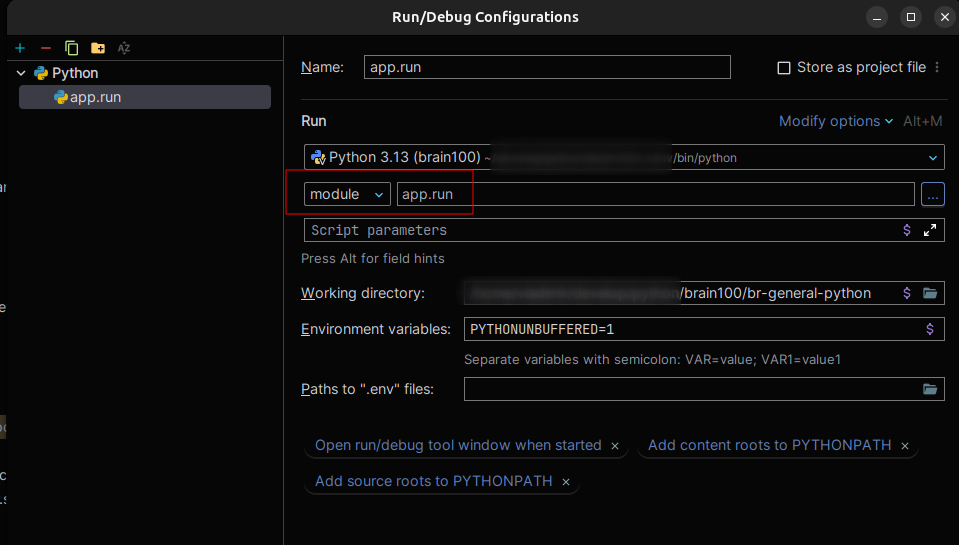

# Backend (FastAPI + Prisma)

This is the Python backend for the **brain100** project.  
It provides REST APIs built with **FastAPI** and uses **Prisma** as the ORM for database access.

---

## Quick Start

### 1. Create and activate virtual environment

```bash
python3 -m venv .venv
source .venv/bin/activate
```

### 2. Install dependencies

```bash
cd br-general-python
pip install -r requirements.txt
pip install --upgrade pip
```

### 3. Set up environment variables

Copy .env.local.example to .env and update values:

```bash
cp .env.local.example .env
```

### 4. Initialize Prisma

```bash
prisma generate
```

### 5. Start dockerized postgresql and grafana

```bash
cd ..
docker compose -f local.docker-compose.yml up --build
```

or (if your system uses the old CLI):

```bash
cd ..
docker-compose -f local.docker-compose.yml up --build
```

### 6. (If needed) Run database migrations

```bash
prisma migrate deploy
```

### 7. Start locally the FastAPI server with connection to the dockerized postgresql and grafana

```bash
cd br-general-python
python -m app.runlocally
```

or
setup PyCharm run configuration to run 'app.locally' directly


### Endpoints

Health Check → http://localhost:8000/api/health

Interactive API Docs → http://localhost:8000/docs